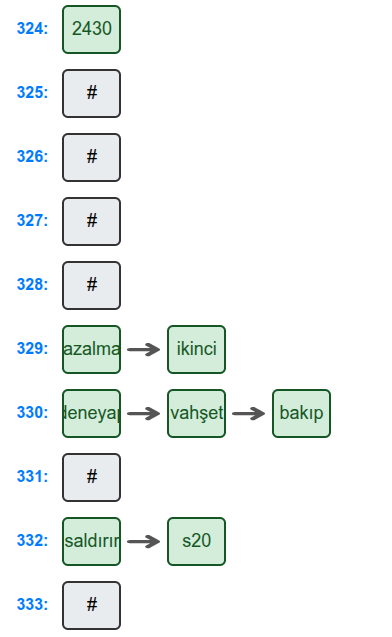
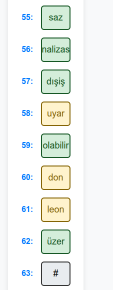
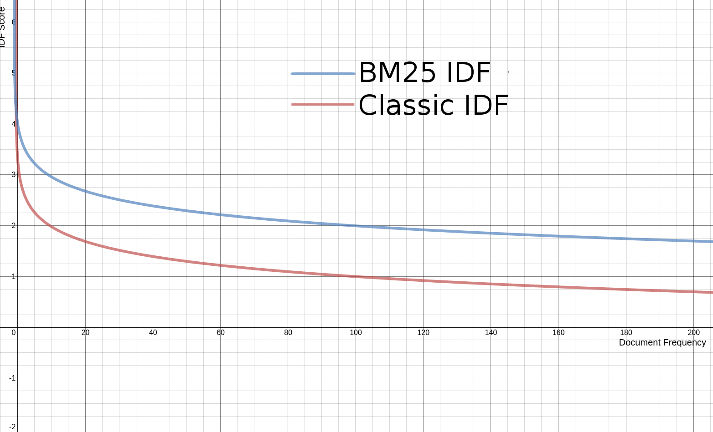
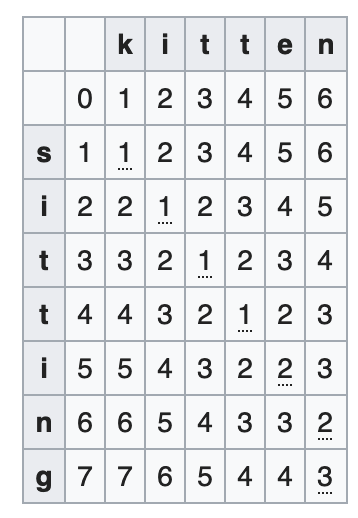

# .NET ile İnteraktif Bir Arama Motoru Geliştirilmesi

## Proje Açıklaması

Projenin amacı hashtable fonksiyonları kullanılarak belirli anahtar kelimelerle eşleşen içeriklerin hızlıca bulunabilmesi için hash tablosu kullanılarak bir arama motoru prototipi geliştirilmesidir. Bu amaç doğrultusunda çeşitli arama algoritmaları ve hashtable fonksiyonları implement edilip performans, bellek kullanımı gibi metrikler bakımından karşılaştırılmıştır. Ayrıca proje kapsamıyla sınırlı kalmayarak hashtable'lara ek olarak dengeli arama ağaçları da eklenmiş ve performans bakımından karşılaştırılmıştır.

Ek olarak, sisteme eklenen auto-completion, wildcard arama, levenshtein distance gibi özelliklerde de gerçek hayat senaryolarına uygun bir arama motoru geliştirilmesi sağlanmıştır.

**Demo:** [https://datastructures-project.fly.dev/](https://datastructures-project.fly.dev/)

## Kullanılan Teknolojiler

- **.NET 9.0:** C# framework'ü ile geliştirilmiştir.
- **ASP.NET Core:** Backend tarafının geliştirilmesinde kullanılmıştır.
- **SQLite:** Çalışmak için ayrı bir daemona ihtiyaç duymadığından PostgreSQL, MariaDB gibi veri tabanlarının yerine kullanılmıştır. Projede dökümanların veritabanında tutulması amacıyla kullanılmıştır.
- **Entity Framework Core:** SQLite ile veri tabanı işlemlerini gerçekleştirmek için varsayılan ORM olarak kullanılmıştır.
- **Scriban:** Projede varsayılan template motoru olarak kullanılmıştır.
- **xUnit:** Projedeki veri yapıları ve algoritmaların test edilmesi için kullanılmıştır. Yazılan unit testler sayesinde projenin her aşamasında ekstra bir kontrole ihtiyaç kalmadan kodun doğru çalıştığı garanti edilmiştir.
- **BenchmarkDotNet:** Projedeki veri yapıları ve algoritmaların performans testleri için kullanılmıştır.
- **Prometheus:** Projenin bellek, CPU kullanımı, arama sayısı gibi metriklerini izlemek için kullanılmıştır.
- **Grafana:** Prometheus ile toplanan metriklerin görselleştirilmesi için kullanılmıştır.
- **Docker:** Projenin konteyner ortamında çalıştırılması için kullanılmıştır. Bu sayede proje izole bir ortamda sorunsuz çalışabilecektir.

## Kurulum

### Docker ile

1. Projenin kök dizininde `docker-compose up` komutu ile konteyner ortamında çalıştırılabilir.
2. Proje çalıştırıldığında `localhost:8080` adresinden erişilebilir.
3. Eğer Grafana kullanılmak isteniyorsa docker-compose ile Grafana da çalıştırıldıktan sonra `localhost:3000` adresinden Grafana arayüzüne erişilmelidir (varsayılan kullanıcı adı ve şifre admin:admin)
4. Grafana paneline giriş yapıldıktan `Configuration > Data Sources` menüsünden Prometheus için data source eklenmelidir. (URL'si `prometheus:9090` olacak)
5. Veri kaynağı eklendikten sonra `Create > Import` menüsünden `grafana_dashboard.json` dosyası yüklenmelidir. Bu sayede projenin kaynak tüketimi, aram sayısı gibi metrikleri grafikler üzerinden görülebilecektir.

### Docker Olmadan

1. Projenin`src/` dizinine gidilerek `dotnet restore` komutu ile bağımlılıklar yüklenmelidir.
2. Projenin kök dizininde `dotnet run` komutu ile çalıştırılabilir.
3. Proje çalıştırıldığında terminalde gözüken port ile projeye tarayıcı üzerinden erişilebilir.

**Not:** Eğer benchmarklar çalıştırılmak isteniyorsa `tests/` dizinine gidip `dotnet restore` komutu ile bağımlılıklar yüklenmelidir. Daha sonra `dotnet run --configuration Release` komutu ile benchmarklar çalıştırılabilir. Benchmarkların çalışması uzun sürdüğü için `Program.cs`'deki `Main` metodunda `BenchmarkRunner.Run<XBenchmarks>();` satırları yorum satırına alınmalıdır. Bu sayede sadece istenen benchmarklar çalıştırılabilir.

**Not:** Unit-testler çalıştırılmak isteniyorsa `tests/` dizinine gidip `dotnet restore` komutu ile bağımlılıklar yüklenmelidir. Daha sonra `dotnet test` komutu ile mevcut unit-testler çalıştırılabilir.

## Web Arayüzü ve Açıklamalar

Projemizin frontend kısmına 4 adet sayfa ekledik: index, results, documents, hashtables

### Index Sayfası

Index sayfasında arama yapılacak metin girilir ve alttaki checkboxlar yardımıyla arama yapılacak veri yapıları seçildikten sonra arama butonuna basılarak arama yapılabilir. Ayrıca auto-completion ile arama yapılacak kelimenin tamamı yazılmadan öneriler gösterilir. Bu özellik sayesinde kullanıcı arama yaparken daha hızlı ve doğru sonuçlar alabilir.

Ek olarak alttaki **Döküman** butonuna tıklanarak Dökümanlar sayfasına gidilip dökümanlar düzenlenebilir.

### Results Sayfası

Results sayfasında arama sonuçları gösterilir. Arama sonuçları, arama yapılan kelimenin döküman içinde geçme sıklığına göre sıralanır. Ayrıca arama sonuçlarının yanında  arama skoru, dökümanların ID'leri, dökümanların içeriği de gösterilir. Bu sayede kullanıcı arama sonuçlarını daha iyi anlayabilir. Ayrıca, sayfanın sağ üstündeki **Arama Süreleri** kutucuğundan veri yapılarına göre arama işleminin kaç milisaniye sürdüğü görülebilir.

Bu sayfada arama sonuçlarını göstermesi istenilen veri yapısı `appsettings.json`'dan ShowResultsOf değişkeni ile belirlenebilir.

### Documents Sayfası

Documents sayfasında index'e yeni döküman eklenebilir, mevcut dökümanlar listelenebilir ve silinebilir. Bu sayede kullanıcı dökümanları kolayca yönetebilir. Ayrıca dökümanların açıklaması ve URL'si de gösterilir. Bu sayede kullanıcı dökümanların içeriğini daha iyi anlayabilir.

### Hashtables Sayfası

Hashtables sayfasında index'e eklenen dökümanların hash tablosu yapısı gösterilir. Bu sayede kullanıcı hash tablosunun nasıl çalıştığını, collisionların nasıl işlendiğini görsel bir şekilde görebilir. Bu sayfada gri kutucuklar hashtable'daki boş alanları, yeşil kutucuklar dolu alanları, sarı kutucuklar ise collision olan alanları gösterirken kırmızı kutucuklar silinmiş olan alanları gösterir. Bu sayede kullanıcı hash tablosunun nasıl çalıştığını daha iyi anlayabilir.





**Not:** HashTables'da collisionların daha etkin bir şekilde görülmesi için `appsettings.json`'dan Search:Index ayarının `inverted` yapılması gerekmektedir.

## Arama Mekanizması

Arama işlemi temelde 3 yapıya ayrılmıştır: tokenizer, indexleme, arama skor algoritmaları.

### Tokenizer

Tokenizer'ın temel amacı, verilen metni tokenize ederek kelime listesine dönüştürmektir. 

Bu işlem sırasında durdurma kelimeleri (stop-words) filtrelenebilir ve sözcükler köklerine indirgenebilir (stemmer). Bu işlemler, yapılandırma ayarlarına bağlı olarak devreye alınır. Aşağıda tokenizer aşamaları örnekle verilmiştir:

- Tokenizer ilk olarak verilen metni küçük parçalara ayırır. `"Bu, bir deneme metnidir. " => "bu, bir deneme metnidir."`
- Noktalama işaretleri ve bazı özel karakterler temizlenir. Bu sayede arama sonuçları daha doğru olur. `"bu, bir deneme metnidir." => "bu bir deneme metnidir"`
- Noktalama işaretleri silinen ve küçük harfe dönüştürülen metin boşluk karakterine göre tokenlere ayrılır. `"bu bir deneme metnidir" => ["bu", "bir", "deneme", "metnidir"]`
- Durdurma kelimeleri (stop-words) filtrelenir. Hangi kelimelerin stop-words olacağı `Resources/stop-words.txt` dosyasından belirlenebilir. `"bu bir deneme metnidir" => ["deneme", "metnidir"]`
- Son olarak kelimeler [Snowball](https://snowballstem.org/algorithms/turkish/stemmer.html) stemmer algoritması ile köklerine indirilir ve çekim ekleri silinmiş tokenler tokenizer tarafından döndürülür. `"deneme", "metnidir" => ["denem", "metni"]`

**Not:** Snowball stemmer Türkçe için çok doğru çalışmadığı için bazen kelimeleri yanlış köke indirgeyebilmektedir. Bunun önüne geçmek için stemmer tarafından değiştirilmemesi istenen kelimeler ve kökler `Resources/ignore-words.txt` dosyasından belirlenebilir.
**Not:** Stemmer ve stop-words aşamaları `appsetting.json` dosyasından devre dışı bırakılabilir.

### Indeksleme

Projede indexleme işlemi için Elasticsearch, Solr gibi arama motorlarında da kullanılan inverted index ve forward index algoritmaları kullanılmıştır. Hangi veri yapısının kullanılacağı `appsettings.json` dosyasından belirlenebilir.

#### Inverted Index

InvertedIndex, her kelime için dökümantaların ve terim frekanslarının tutulduğu bir ters indeks yapısını temsil eder. Temelde bir hash-table veya ağaç yapısı kullanılarak oluşturulmuş olan bir `IDictionary` yapısı üzerine kurulu olan bu veri yapısı, metin verilerinin indekslenmesi, kelimelerin sıklıklarının hesaplanması, dökümantaların yönetilmesi ve arama yapılması gibi temel işlevleri yerine getirir. Örneğin `["deneme", "metni", "deneme"]` ve `["bilgisayar", "telefon"]` dökümanları inverted index veri yapısında  aşağıdaki tablodaki gibi tutulur:

| Kelime | Döküman ID'leri | Terim Frekansı |
|--------|------------------|----------------|
| deneme | 1, 1, 2            | 3              |
| metni  | 1                | 1              |
| bilgisayar | 2            | 1              |
| telefon | 2                | 1              |
- `Döküman ID'leri`: Kelimenin geçtiği dökümanların ID'leri
- `Terim Frekansı`: Kelimenin döküman içinde kaç kez geçtiği
- `InvertedIndex` veri yapısı, kelimelerin döküman ID'leri ve terim frekansları ile birlikte tutulmasını sağlar. Bu sayede arama işlemleri daha hızlı ve verimli bir şekilde gerçekleştirilebilir.

Projede geliştirmiş olduğumuz Inverted Index yapısına ait metodların algoritmik zaman karmaşıklığı aşağıdaki tablodaki gibidir:

| Metod | Best Case | Worst Case |
|--------|-----------|------------|
| `Add` | O(n)          | O(n^2)       |
| `DocumentCount` | O(n)         | O(n^2)        |
| `DocumentWordsCount` | O(1)          | O(n^2)         |
| `WordDocuments` **(Search)** | O(1)          | O(1)         |
| `DocumentIds` | O(n^2)          | O(n^2)         |
| `Tokens`        | O(n^2)          | O(n^3)         |
| `DocumentIds` | O(n^2)          | O(n^2)         |
| `Remove` | O(1)          | O(n^2)         |

**Not:** Karmaşıklık hesabı yapılırken Trie veri yapısının etkisi göz ardı edilmiştir.

#### Forward Index

ForwardIndex, her döküman için kelimeleri ve terim frekanslarını tutan bir veri yapısını temsil eder. InvertedIndex'in aksine ForwardIndex döküman ID'lerini key, tokenleri ve terim frekanslarını value olarak tutar. Bu yapı, döküman eklemede hızlı bir şekilde çalışır. Ancak, kelimenin hangi dökümanlarda geçtiğine dair bir sorgulama yapılacaksa, bu işlem inverted index yapısına göre daha verimsiz olacaktır.

Bu yapı, dökümanların kelime dağılımını hızlı bir şekilde gözlemlemek için kullanılır. Örneğin `["deneme", "metni"]` ve `["bilgisayar", "telefon"]` dökümanları forward index veri yapısında aşağıdaki tablodaki gibi tutulur:

| Döküman ID | Kelime | Terim Frekansı |
|------------|--------|----------------|
| 1          | deneme | 2              |
| 1          | metni  | 1              |
| 2          | bilgisayar | 1          |
| 2          | telefon | 1              |

- `Döküman ID`: Kelimenin bulunduğu dökümanın kimliği
- `Kelime`: Dökümanda geçen kelime
- `Terim Frekansı`: Kelimenin dökümanda kaç kez geçtiği

Projede geliştirilmiş olan Forward Index yapısının algoritmik zaman karmaşıklığı aşağıdaki tablodaki gibidir:

| Metod              | Best Case | Worst Case |
| ------------------ | --------- | ---------- |
| `Add`                | O(n)      | O(n^2)     |
| `DocumentCount`      | O(1)      | O(1)       |
| `DocumentWordsCount` | O(1)      | O(n)       |
| `WordDocuments` **(Search)**      | O(n)      | O(n^2)       |
| `DocumentLength`     | O(1)      | O(n)       |
| `Tokens`             | O(n)      | O(n)     |
| `DocumentIds`        | O(1)      | O(1)       |
| `Remove`             | O(1)      | O(1)       |

**Not:** Karmaşıklık hesabı yapılırken Trie veri yapısının etkisi göz ardı edilmiştir.

#### Inverted Index ve Forward Index Yapılarının Performans Karşılaştırması

Yukarıdaki karmaşıklık hesaplarına bakılarak inverted index ve forward index yapılarının performans karşılaştırması aşağıdaki gibi yapılabilir:

- **Eleman Ekleme:** Inverted Index algoritması, eleman ekleme işlemi sırasında **O(n^2)** karmaşıklığına sahipken, Forward Index algoritması **O(n)** karmaşıklığına sahiptir. Bu nedenle eleman ekleme işleminin sık olduğu durumlarda Forward Index algoritması daha hızlı çalışır.

- **Eleman Arama:** Inverted Index algoritması, eleman arama işlemi sırasında **O(1)** karmaşıklığına sahipken, Forward Index algoritması **O(n)** karmaşıklığına sahiptir. Bu nedenle eleman arama işleminin sık olduğu durumlarda Inverted Index algoritması daha hızlı çalışır.

- **Eleman Silme:** Inverted Index algoritması, eleman silme işlemi sırasında **O(n^2)** karmaşıklığına sahipken, Forward Index algoritması elemanı direkt olarak Dictionary'den sildiği için **O(1)** karmaşıklığına sahiptir. Bu nedenle eleman silme işleminin sık olduğu durumlarda Forward Index algoritması daha hızlı çalışır.

Yukarıdaki analizleri doğrulayacak benchmark sonuçları ise şu şekildedir:

```sh
| Method                             | N    | Mean       | Error     | StdDev     | Median      | Min         | Max        | Allocated |
|----------------------------------- |----- |-----------:|----------:|-----------:|------------:|------------:|-----------:|----------:|
| InvertedIndex_AddDocument          | 1000 | 444.384 us | 18.534 us | 281.292 us | 428.1690 us | 241.6590 us | 3,466.7 us |   33736 B |
| InvertedIndex_DocumentCount        | 1000 |  74.885 us |  2.195 us |  33.317 us |  69.6925 us |  61.2260 us |   529.6 us |    4152 B |
| InvertedIndex_DocumentWordsCount   | 1000 |  81.874 us | 18.319 us | 278.030 us |  50.9870 us |  45.5670 us | 3,075.3 us |    1448 B |
| InvertedIndex_GetWords             | 1000 |  11.503 us |  3.571 us |  54.199 us |   5.1400 us |   4.4780 us |   646.8 us |    1072 B |
| InvertedIndex_WordDocuments        | 1000 |   5.551 us |  3.202 us |  48.596 us |   0.5910 us |   0.4710 us |   659.3 us |     736 B |
| InvertedIndex_DocumentLength       | 1000 |   9.761 us |  2.066 us |  31.354 us |   6.0920 us |   5.4800 us |   364.4 us |    1760 B |
| InvertedIndex_WordDocuments_Empty  | 1000 |   5.427 us |  3.111 us |  47.218 us |   0.6010 us |   0.4610 us |   577.4 us |     736 B |
| InvertedIndex_DocumentLength_Empty | 1000 |  36.714 us |  2.119 us |  32.162 us |  31.1395 us |  28.8550 us |   408.8 us |    1296 B |
| InvertedIndex_GetWords_Empty       | 1000 |  11.479 us |  3.561 us |  54.043 us |   5.1600 us |   4.4380 us |   668.2 us |    1072 B |
| InvertedIndex_DocumentIds          | 1000 |  82.590 us |  7.125 us | 108.144 us |  69.0060 us |  62.2580 us | 1,326.1 us |    4408 B |
| InvertedIndex_Tokens               | 1000 |  22.297 us |  8.197 us | 124.412 us |   8.9220 us |   7.9750 us | 1,643.5 us |    2488 B |
| InvertedIndex_AddRemove            | 1000 | 556.533 us | 10.686 us | 162.187 us | 527.3625 us | 479.5220 us | 2,328.4 us |   26576 B |
```

```sh
| Method                            | N    | Mean      | Error    | StdDev     | Median     | Min        | Max        | Allocated |
|---------------------------------- |----- |----------:|---------:|-----------:|-----------:|-----------:|-----------:|----------:|
| ForwardIndex_AddDocument          | 1000 | 61.009 us | 6.884 us | 104.472 us | 46.9290 us | 37.5720 us | 1,228.7 us |    9744 B |
| ForwardIndex_DocumentCount        | 1000 |  3.460 us | 2.081 us |  31.586 us |  0.2810 us |  0.2010 us |   434.0 us |     736 B |
| ForwardIndex_DocumentWordsCount   | 1000 |  8.477 us | 3.133 us |  47.549 us |  3.3060 us |  2.9360 us |   578.7 us |     840 B |
| ForwardIndex_GetWords             | 1000 | 11.266 us | 3.484 us |  52.883 us |  5.0500 us |  4.3980 us |   641.9 us |    1072 B |
| ForwardIndex_WordDocuments        | 1000 | 30.888 us | 6.279 us |  95.298 us | 19.7875 us | 15.6200 us | 1,026.7 us |     824 B |
| ForwardIndex_DocumentLength       | 1000 |  6.945 us | 2.115 us |  32.106 us |  3.3670 us |  2.9460 us |   462.0 us |     840 B |
| ForwardIndex_WordDocuments_Empty  | 1000 | 30.448 us | 6.325 us |  95.995 us | 19.5675 us | 15.5700 us | 1,117.9 us |     824 B |
| ForwardIndex_DocumentLength_Empty | 1000 |  3.359 us | 1.913 us |  29.039 us |  0.4110 us |  0.2600 us |   360.1 us |     736 B |
| ForwardIndex_GetWords_Empty       | 1000 | 10.983 us | 3.382 us |  51.323 us |  5.0500 us |  4.3890 us |   613.3 us |    1072 B |
| ForwardIndex_DocumentIds          | 1000 | 12.689 us | 6.725 us | 102.061 us |  1.9630 us |  1.6630 us | 1,539.7 us |     992 B |
| ForwardIndex_Tokens               | 1000 | 15.547 us | 6.993 us | 106.134 us |  4.3680 us |  3.7370 us | 1,336.4 us |    1464 B |
| ForwardIndex_AddRemove            | 1000 | 42.757 us | 3.453 us |  52.402 us | 33.2280 us | 29.8070 us |   643.4 us |    8008 B |
```

Benchmark sonuçlarından görülebileceği gibi inverted index algoritması eleman arama işlemlerinde 6 kat daha hızlı çalışırken eleman ekleme işleminde 7 kat, eleman silme işleminde ise 13 kat daha yavaş çalışmaktadır. Bu sonuçlara göre de algoritmaların karmaşıklık hesapları doğrulanmış olmaktadır.

### Arama Skor Algoritmaları

Projede arama sonuçlarının hesaplanması için TF-IDF ve Okapi BM25 algoritmaları tercih edilmiştir.

#### TF-IDF

NLP ve arama motorlarında sıkça kullanılan TF-IDF (Term Frequency - Inverse Document Frequency) algoritması adından da anlaşılabileceği gibi bir index içinde aranan kelimenin belirli bir dökümanda geçme sıklığını (TF) ve döküman sayısına göre kelimenin önemini (IDF) hesaplayarak arama sonuçlarını sıralar. 
TF-IDF algoritması, kelimenin döküman içinde ne kadar önemli olduğunu belirlemek için kullanılır. TF-IDF algoritması, kelimenin döküman içinde geçme sıklığını ve kelimenin döküman sayısına göre önemini hesaplayarak arama sonuçlarını sıralar.

Formül:

$$
TFIDF(w, d) = TF(w, d) * IDF(w)
$$

- **TF (Term Frequency):** Kelimenin döküman içinde geçme sıklığını ifade eder. Kelimenin döküman içinde kaç kez geçtiği ile hesaplanır. TF, kelimenin döküman içindeki önemini belirler.
- **IDF (Inverse Document Frequency):** Kelimenin döküman sayısına göre önemini belirler.

TF değeri düz olarak o dökümandaki istenen token sayısının o dökümandaki toplam token sayısına bölümü ile hesaplanacağı gibi logirtmik normalization işlemi yapılarak daha doğru sonuçlar elde edilebilir. Bu amaçla projede kullanılan `k=0.5` normalization değerine sahip TF fonksiyonu şekildeki gibidir:

$$
TF(t,d) = 0.5 + 0.5 \cdot \frac{f_{t,}}{f_{\max}}
$$

- **f(t,d):** Kelimenin döküman içinde geçme sıklığı
- **f(max):** Döküman içindeki toplam kelime sayısı
- **k:** Normalizasyon değeri (0.5 olarak aldık)

Kullandığımız IDF değeri ise aşağıdaki formüle göre hesaplanmaktadır:

$$
IDF(w) = \ln \left( \frac{N}{1 + n(w)} +1 \right)
$$

- **N:** Toplam döküman sayısı
- **n(w):** Kelimenin geçtiği döküman sayısı

Örneğin aşağıdaki dökümanları ele alalım:

| Döküman ID | Kelimeler |
|------------|-----------|
| 1          | deneme, metni |
| 2          | bilgisayar, telefon, deneme |
| 3          | deneme, bilgisayar |

Örneğin bu indexte TFIDF() fonksiyonu ile `deneme` kelimesinin 2. dökümandaki değeri şu şekilde hesaplanır:

$$
TFIDF(deneme, 2) = TF(deneme, 2) * IDF(deneme)
$$

$$
TF(deneme, 2) = \frac{f_{deneme,2}}{f_{\max}} = \frac{1}{3} = 0.3333
$$

$$
IDF(deneme) = \ln \left( \frac{3}{1 + 3} +1 \right) = \ln(1.75) = 0.5596
$$

Projede oluşturduğumuz TF-IDF yapısına ait metodların algoritmik zaman karmaşıklığı aşağıdaki tablodaki gibidir:

| Metod | Best Case | Worst Case |
|--------|-----------|------------|
| `Calculate` | O(n)          | O(n^3)       |

#### Okapi BM25

Okapi BM25 (Best Match 25), TF-IDF algoritmasına göre daha gelişmiş bir algoritmadır. BM25, kelimenin döküman içindeki önemini belirlemek için TF ve IDF değerlerini kullanır. Ancak, Okapi BM25 algoritması, kelimenin döküman içindeki önemini belirlemek için dökümandaki kelime sayısı, indexteki ortalama döküman uzunluğu gibi ekstra parametreleri kullanır. Bu sayede daha doğru sonuçlar elde edilebilir.

BM25 algoritması, kelimenin döküman içindeki önemini belirlemek için aşağıdaki formülü kullanır:

$$
BM25(w, d) = IDF(w) * \frac{TF(w, d) * (k_1 + 1)}{TF(w, d) + k_1 * (1 - b + b * \frac{L(d)}{L_{avg}})}
$$

- **IDF(w):** Kelimenin döküman sayısına göre önemini belirler.
- **TF(w, d):** Kelimenin döküman içinde geçme sıklığını ifade eder.
- **k1:** Kelimenin döküman içindeki önemini belirler. (1.2 ve 2.0 aralığında seçilir)
- **b:** Kelimenin döküman içindeki önemini belirler. ( genelde 0.75 olarak alonır)
- **L(d):** Döküman içindeki toplam kelime sayısını ifade eder.
- **L(avg):** Indexteki ortalama döküman uzunluğunu ifade eder.

$$
IDF(w) = \ln \left( \frac{N - n(w) + 0.5}{n(w) + 0.5} +1 \right)
$$

- **N:** Toplam döküman sayısı
- **n(w):** Kelimenin geçtiği döküman sayısı

Yukarıdaki dökümanları tekrar ele alalım:
| Döküman ID | Kelimeler |
|------------|-----------|
| 1          | deneme, metni |
| 2          | bilgisayar, telefon, deneme |
| 3          | deneme, bilgisayar |

Örneğin bu indexte BM25() fonksiyonu ile `deneme` kelimesinin 2. dökümandaki değeri şu şekilde hesaplanır:

$$
BM25(deneme, 2) = IDF(deneme) * \frac{TF(deneme, 2) * (k_1 + 1)}{TF(deneme, 2) + k_1 * (1 - b + b * \frac{L(2)}{L_{avg}})}
$$

$$
IDF(deneme) = \ln \left( \frac{3 - 2 + 0.5}{2 + 0.5} +1 \right) = \ln(1.6) = 0.4700
$$

$$
TF(deneme, 2) = \frac{f_{deneme,2}}{f_{\max}} = \frac{1}{3} = 0.3333
$$

$$
L(2) = 3
$$

$$
L_{avg} = \frac{3 + 3 + 2}{3} = 2.67
$$

$$
BM25(deneme, 2) = 0.4700 * \frac{0.3333 * (1.2 + 1)}{0.3333 + 1.2 * (1 - 0.75 + 0.75 * \frac{3}{2.67})}
$$

Projede oluşturduğumuz BM25 yapısına ait metodların algoritmik zaman karmaşıklığı aşağıdaki tablodaki gibidir:

| Metod | Best Case | Worst Case |
|--------|-----------|------------|
| Calculate | O(n)          | O(n^3)       |

#### TF-IDF ve BM25'in Performans ve Hassasiyet Karşılaştırması

Üstte karmaşıklıklarını verdiğimiz TF-IDF ve BM25 algoritmalarının benchmark sonuçları aşağıdaki gibidir:

```sh
| Method                   | N    | Mean     | Error    | StdDev     | Median   | Min      | Max         | Allocated |
|------------------------- |----- |---------:|---------:|-----------:|---------:|---------:|------------:|----------:|
| TFIDF_Calculate_Multiple | 1000 | 461.0 us | 96.32 us | 1,461.9 us | 287.7 us | 208.6 us | 18,009.3 us |   6.87 KB |
| TFIDF_Calculate_Single   | 1000 | 444.9 us | 93.24 us | 1,415.1 us | 275.0 us | 190.7 us | 15,490.5 us |   5.41 KB |
```

```sh
| Method                  | N    | Mean     | Error    | StdDev     | Median   | Min      | Max         | Allocated |
|------------------------ |----- |---------:|---------:|-----------:|---------:|---------:|------------:|----------:|
| BM25_Calculate_Multiple | 1000 | 680.0 us | 88.69 us | 1,346.1 us | 511.5 us | 393.6 us | 14,827.4 us |  10.38 KB |
| BM25_Calculate_Single   | 1000 | 642.6 us | 85.70 us | 1,300.7 us | 483.3 us | 374.1 us | 14,279.4 us |   8.22 KB |
```

Benchmark sonuçlarından görülebileceği gibi BM25 algoritması TF-IDF algoritmasına göre 1.5 kat daha yavaş çalışmaktadır. Bu sonuçlar, BM25 algoritmasının daha fazla parametre kullanmasından kaynaklanmaktadır. Ancak, BM25 algoritması kullandığı ekstra parametreler sayesinde daha logaritmik, yani daha dengeli sonuçlar elde edebilmektedir. Bu nedenle BM25 algoritması, TF-IDF algoritmasına göre daha doğru sonuçlar vermektedir. Aşağıdaki grafik de bunu doğrular şekildedir:



### Auto-completion ve Wildcard Arama

Sistemde auto-completion ve wildcard özelliklerini sunmak için Trie (Prefix-tree) veri yapısı kullanılmıştır. 

Indexleme sırasında kelimelerin kökleri Trie veri yapısına eklenir. Kullanıcı arama yaptığında, Trie veri yapısı kullanılarak kelime char'ları tek tek kontrol edilir ve kelimenin son harfine gelene kadar alt düğüm için bakılır. Eğer son düğüm isEnd değilse, kelime Trie'da yok demektir. Eğer son düğüm isEnd ise, kelime Trie'da var demektir. Bu sayede kelimenin Trie'da olup olmadığı kontrol edilebilir.

Trie'a eklenirkense kelime karakterlerine ayrıştırılır ve her bir karakter için yeni bir düğüm oluşturulur. Kelimenin son karakterine gelindiğinde ise isEnd değeri true olarak ayarlanır. Bu sayede kelimenin Trie'da olup olmadığı kontrol edilebilir.

Projede geliştirdiğimiz prefix tree yapısı her bir node için char anahtar kelimeli bir dictionary ve değer olarak da çocuk nodeları tutan bir dictionary yapısı kullanmaktadır. Bu sayede kelime sayısı çok olsa bile istenen kelimenin index'te olup olmadığı en kötü durumda O(n) karmaşıklığı ile bulunabilir.

Wildcard search ile de kelimenin içinde `*` karakteri kullanılarak arama yapılabilir. Örnein `*lik*` query'si ile `kalemlik`, `katiplik`, `zenginlik` gibi kelimeler bulunabilir. Bu işlem sırasında `*` karakteri ile wildcard arama yapılacaksa, Trie veri yapısında `*` karakterinin geçtiği düğümden itibaren tüm alt düğümler kontrol edilir. Bu sayede wildcard arama yapılabilir.

Projede geliştirmiş olduğumuz Trie veri yapısının algoritmik zaman karmaşıklığı aşağıdaki tablodaki gibidir:

| Metod               | Best Case | Worst Case                       |
| ------------------- | --------- | -------------------------------- |
| `AddWord`           | O(L)      | O(L)                             |
| `SearchWord`        | O(1)      | O(L)                             |
| `GetWords`          | O(P)      | O(P + K)                         |
| `WildcardSearch`    | O(L)      | O(Σ^L)                           |
| `LevenshteinSearch` | O(W \* L) | O(W \* L²)                       |
| `GetTokens`         | O(T \* L) | O(T \* W \* L²) veya O(T \* Σ^L) |
- **L:** Kelimenin uzunluğu
- **P:** Prefix uzunluğu
- **K:** Kelime sayısı
- **T:** Token sayısı
- **W:** Wildcard sayısı
- **Σ:** Kelime karakter sayısı

Referans olması açısından Trie veri yapısı için oluşturulmuş benchmark sonuçları aşağıdaki gibidir:

```sh
| Method             | N     | Mean         | Error     | StdDev       | Median      | Min         | Max        | Allocated |
|------------------- |------ |-------------:|----------:|-------------:|------------:|------------:|-----------:|----------:|
| AddWord            | 100   |     9.333 us |  3.067 us |    46.548 us |   3.7670 us |   2.8960 us |   668.0 us |    1200 B |
| AddNWords          | 100   |    56.086 us |  3.448 us |    52.330 us |  48.1420 us |  22.0920 us |   664.4 us |    5792 B |
| SearchWord         | 100   |     7.402 us |  4.196 us |    63.678 us |   0.7810 us |   0.5410 us |   821.9 us |     736 B |
| GetWordsWithPrefix | 100   |    16.663 us |  6.812 us |   103.384 us |   5.1000 us |   4.3780 us | 1,112.8 us |    1488 B |
| WildcardSearch     | 100   |    17.157 us |  6.959 us |   105.612 us |   5.5610 us |   4.6390 us | 1,215.8 us |    1592 B |
| LevenshteinSearch  | 100   |    29.270 us | 11.049 us |   167.697 us |  10.9410 us |   9.2880 us | 2,061.0 us |    3632 B |
| AddWord            | 1000  |     9.713 us |  3.170 us |    48.119 us |   3.9070 us |   2.9950 us |   586.4 us |    1200 B |
| AddNWords          | 1000  |   148.945 us |  8.549 us |   129.756 us | 123.0540 us |  95.1110 us | 1,755.3 us |    5792 B |
| SearchWord         | 1000  |     7.184 us |  4.052 us |    61.495 us |   0.8220 us |   0.5010 us |   697.1 us |     736 B |
| GetWordsWithPrefix | 1000  |    16.882 us |  6.875 us |   104.346 us |   5.5505 us |   4.3380 us | 1,281.8 us |    1488 B |
| WildcardSearch     | 1000  |    17.445 us |  7.008 us |   106.354 us |   5.7010 us |   4.6790 us | 1,240.3 us |    1592 B |
| LevenshteinSearch  | 1000  |    30.115 us | 11.315 us |   171.735 us |  11.1215 us |   9.4180 us | 1,996.8 us |    3632 B |
| AddWord            | 10000 |    16.827 us |  3.570 us |    54.181 us |   9.3380 us |   3.7870 us | 1,193.1 us |    1200 B |
| AddNWords          | 10000 | 1,474.773 us | 80.689 us | 1,224.625 us | 679.2120 us | 486.8960 us | 4,935.5 us |    5792 B |
| SearchWord         | 10000 |     9.618 us |  4.251 us |    64.516 us |   2.3040 us |   0.7610 us |   787.2 us |     736 B |
| GetWordsWithPrefix | 10000 |    26.164 us |  7.393 us |   112.206 us |  10.2950 us |   5.2900 us | 1,324.5 us |    1488 B |
| WildcardSearch     | 10000 |    26.020 us |  7.488 us |   113.649 us |  10.4300 us |   5.4810 us | 1,561.3 us |    1592 B |
| LevenshteinSearch  | 10000 |    33.439 us | 11.239 us |   170.572 us |  12.9950 us |   5.5210 us | 2,034.5 us |    3632 B |
```

### Levenshtein Distance

Arama motorlarında bir token aranırken sıkça yazım hataları olabilmektedir ve bu hataların düzeltilmesi doğru arama sonuçlarını elde edebilmek için önemlidir. Bu nedenle kelime yakınlık algoritmaları kullanılarak kullanıcının girmiş olduğu token'a benzer tokenların da arama sırasında değerlendirilmesi gerekmektedir. Örneğin `bilgisayr` token'ı arandığında `bilgisayar` token'ının da bulunması gerekmektedir. Biz de bu amaçla Levenshtein Distance algoritmasını kullanmaya karar verdik. Levenshtein Distance algoritması, iki kelime arasındaki edit distance'ı hesaplayarak kelimelerin benzerliğini belirler. Edit distance, iki kelime arasındaki minimum edit işlemi sayısını ifade eder. Edit işlemleri ise ekleme, silme ve değiştirme işlemlerinden biri olabilir.

Recursive ve matris yöntemi ile oluşturulmuş iki farklı algoritma ile Levenshtein Distance hesaplanabilmektedir. Recursive algoritma, iki kelime arasındaki edit distance'ı hesaplamak için recursive olarak çağrılır. Matris yöntemi ise iki kelime arasındaki edit distance'ı hesaplamak için bir matris oluşturur ve bu matrisi kullanarak edit distance'ı hesaplar. Matris yöntemi, recursive algoritmaya göre daha hızlı çalışmaktadır.

Recursive yaklaşım ile oluşturulan Levenshtein algoritmasının zaman karmaşıklığı **O(3^(m+n))** iken, matris yöntemi ile oluşturulan Levenshtein algoritmasının zaman karmaşıklığı **O(n*m)** şeklindedir. Bu nedenle matris yöntemi daha hızlı çalışmaktadır. Ancak, matris yöntemi daha fazla bellek kullanmaktadır. Biz de bu trade-off'u göz önünde bulundurarak projemizdeki Levenshtein algoritmasını matris yöntemi ile oluşturmaya karar verdik. Bu sayede daha hızlı arama sonuçları elde edebildik.



**Not:** Projede levenshtein algoritması ile arama yapılırken Trie veri yapısından  da yararlanılmıştır.

**Not:** Levenshtein algoritmasının distance parametresi `appsettings.json` içinden değiştirilip etkisi görülebilir. Yüksek distance parametresi performansı kötü etkilediğinden 3'ün üstüne çıkarılmaması tavsiye edilir.

## Indekslenen Verinin Tutulması için Kullanılan Veri Yapıları

Arama mekanizmasının indexleme kısmında aşağıdaki veri yapıları kullanılmıştır:

### Linear Probing Hash Table

Lineer probing, açık adresleme (open addressing) yöntemlerinden biridir. Bir anahtarın (key) hash değeri hesaplandıktan sonra:

İlgili indeks boşsa, anahtar o hücreye yerleştirilir.
Doluysa, bir sonraki hücreye (index + 1) bakılır.
Bu arama, boş bir hücre bulunana kadar lineer olarak devam eder.
Dizinin sonuna gelinirse başa dönülür (mod işlemi ile).

Çakışmaları (collisions) çözmenin basit ama etkili bir yoludur.


| **Metot**                | **Best Case** | **Worst Case** | **Açıklama**                                                             |
| ------------------------ | ------------- | -------------- | ------------------------------------------------------------------------ |
| `Add` / `Insert`         | O(1)          | O(n)           | Hash yeri boşsa O(1), çakışmalarla tüm tablo dolaşılabilir               |
| `TryGetValue`            | O(1)          | O(n)           | Anahtar ilk pozisyondaysa hızlı erişim, aksi halde tüm tablo gezilebilir |
| `ContainsKey`            | O(1)          | O(n)           | `TryGetValue` çağrısı üzerinden                                          |
| `Remove`                 | O(1)          | O(n)           | Anahtar yakınsa hızlı, değilse uzun arama gerekir                        |
| `this[key] get`          | O(1)          | O(n)           | İçeride `TryGetValue` çağrısı var                                        |
| `this[key] set`          | O(1)          | O(n)           | Anahtar varsa güncelleme, yoksa `Add` ile ekleme yapılır                 |
| `Keys` / `Values`        | O(n)          | O(n)           | Tüm tabloyu tarayarak geçerli girişleri toplar                           |
| `Clear`                  | O(n)          | O(n)           | Yeni boş tablo oluşturulur                                               |
| `CopyTo`                 | O(n)          | O(n)           | Tüm anahtar-değer çiftlerini hedef diziye kopyalar                       |
| `IsInCollide`            | O(1)          | O(n)           | İlk pozisyonda değilse çakışma kabul edilir                              |
| `GetTombstones`          | O(n)          | O(n)           | Tüm tabloda tombstone (silinmiş) girişleri bulur                         |
| `GetEnumerator`          | O(n)          | O(n)           | Tüm geçerli kayıtları döner                                              |
| `GetEnumeratorWithIndex` | O(n)          | O(n)           | Her pozisyonu gezip indeksle birlikte döner                              |


```sh
| Method                                       | N     | Mean     | Error    | StdDev    | Median    | Min       | Max        | Allocated |
|--------------------------------------------- |------ |---------:|---------:|----------:|----------:|----------:|-----------:|----------:|
| Benchmark_LinearProbingHashTable_TryGetValue | 1000  | 114.7 us |  7.46 us | 113.20 us |  94.39 us |  62.68 us | 1,501.8 us |     736 B |
| Benchmark_LinearProbingHashTable_Add         | 1000  | 124.8 us | 10.77 us | 163.42 us |  97.75 us |  78.67 us | 2,367.0 us |  320792 B |
| Benchmark_LinearProbingHashTable_ContainsKey | 1000  | 102.8 us |  6.43 us |  97.62 us |  85.01 us |  65.53 us | 1,220.2 us |     736 B |
| Benchmark_LinearProbingHashTable_AddRemove   | 1000  | 150.6 us | 15.94 us | 242.00 us | 107.42 us |  87.11 us | 2,815.0 us |  320792 B |
| Benchmark_LinearProbingHashTable_TryGetValue | 10000 | 210.6 us | 15.05 us | 228.41 us | 178.37 us | 123.80 us | 2,717.5 us |     736 B |
| Benchmark_LinearProbingHashTable_Add         | 10000 | 605.4 us | 19.41 us | 294.53 us | 550.01 us | 200.70 us | 3,778.7 us |  320792 B |
| Benchmark_LinearProbingHashTable_ContainsKey | 10000 | 208.9 us | 15.52 us | 235.50 us | 176.77 us | 122.43 us | 3,120.8 us |     736 B |
| Benchmark_LinearProbingHashTable_AddRemove   | 10000 | 722.7 us | 26.31 us | 399.28 us | 683.70 us | 304.08 us | 5,682.3 us |  320792 B |
```

### Quadratic Probing Hash Table

Quadratic Probing (Karesel Sondalama), açık adreslemeli (open addressing) hash tablolarında çakışmaları çözmek için kullanılan bir yöntemdir. Lineer probing'deki gibi sırayla bir sonraki hücreye değil, artan karesel aralıklarla tabloya bakılır.

Index_i = (h(key) + c₁ * i + c₂ * i²) mod TableSize


Varsayılan olarak: `c₁ = 0`, `c₂ = 1` seçilirse:


h(key), h(key) + 1², h(key) + 2², h(key) + 3², ...

Quadratic Probing Hash Table - Zaman Karmaşıklığı

| Metot/Fonksiyon               | Best Case        | Average Case                | Worst Case                 | Açıklama |
|------------------------------|------------------|-----------------------------|----------------------------|----------|
| `Add(TKey key, TValue val)`  | O(1)             | O(1 / (1 - α))              | O(n)                       | İlk denemede boş slot varsa hızlı. Çakışma varsa kare artışla ilerlenir. |
| `InsertWithoutResize(...)`   | O(1)             | O(1 / (1 - α))              | O(n)                       | `Add` gibi çalışır, ancak `Resize` yapılmaz. |
| `TryGetValue(TKey key)`      | O(1)             | O(1 / (1 - α))              | O(n)                       | Aranan anahtar ilk slottaysa çok hızlı. |
| `ContainsKey(TKey key)`      | O(1)             | O(1 / (1 - α))              | O(n)                       | `TryGetValue` çağırır. |
| `Remove(TKey key)`           | O(1)             | O(1 / (1 - α))              | O(n)                       | Anahtar erken bulunursa hızlı. |
| `this[TKey key]` (get)       | O(1)             | O(1 / (1 - α))              | O(n)                       | `TryGetValue` çağırır. |
| `this[TKey key]` (set)       | O(1)             | O(1 / (1 - α))              | O(n)                       | Anahtar varsa günceller, yoksa ekler. |
| `Clear()`                    | O(n)             | O(n)                        | O(n)                       | Tüm tabloyu sıfırlar. |
| `CopyTo(...)`                | O(n)             | O(n)                        | O(n)                       | Tüm geçerli elemanlar başka diziye kopyalanır. |
| `GetEnumerator()`            | O(n)             | O(n)                        | O(n)                       | Tablonun tamamı üzerinde gezinir. |
| `GetEnumeratorWithIndex()`   | O(n)             | O(n)                        | O(n)                       | Hem indeks hem veri verilir. |
| `GetTombstones()`            | O(n)             | O(n)                        | O(n)                       | Silinmiş (tombstone) girişleri listeler. |
| `Resize()`                   | —                | O(n)                        | O(n)                       | Tüm tablo yeniden yerleştirilir. |
| `IsInCollide(TKey key)`      | O(1)             | O(1 / (1 - α))              | O(n)                       | Anahtar çakışma sonucu yerleşmiş mi diye kontrol eder. |
| `GetNextPrime(int)`          | O(1)~O(√n)       | O(√n)                       | O(√n)                      | Yeni tablo boyutu seçilirken asal kontrol yapılır. |
| `IsPrime(int)`              | O(1)~O(√n)       | O(√n)                       | O(√n)                      | Asal sayı kontrolü yapılır. |

> **Notlar**:
> - `α`: Load factor (doluluk oranı) — `_count / _size`
> - `O(1 / (1 - α))`: Ortalama karmaşıklık, yük faktörü arttıkça yavaşlar.
> - `Resize()` işlemi amortize edilmiştir ve nadiren çağrılır.


```sh
| Method                                          | N     | Mean     | Error    | StdDev   | Median    | Min       | Max        | Allocated |
|------------------------------------------------ |------ |---------:|---------:|---------:|----------:|----------:|-----------:|----------:|
| Benchmark_QuadraticProbingHashTable_TryGetValue | 1000  | 110.5 us |  7.16 us | 108.7 us |  91.51 us |  62.44 us | 1,320.3 us |     736 B |
| Benchmark_QuadraticProbingHashTable_Add         | 1000  | 141.8 us | 12.62 us | 191.5 us | 109.85 us |  91.15 us | 2,336.7 us |  320968 B |
| Benchmark_QuadraticProbingHashTable_ContainsKey | 1000  | 116.5 us |  7.29 us | 110.6 us |  96.17 us |  65.27 us | 1,288.8 us |     736 B |
| Benchmark_QuadraticProbingHashTable_AddRemove   | 1000  | 164.2 us | 18.33 us | 278.2 us | 115.43 us |  97.10 us | 3,031.0 us |  320968 B |
| Benchmark_QuadraticProbingHashTable_TryGetValue | 10000 | 218.4 us | 15.92 us | 241.7 us | 183.02 us | 126.31 us | 3,278.5 us |     736 B |
| Benchmark_QuadraticProbingHashTable_Add         | 10000 | 608.1 us | 21.12 us | 320.5 us | 553.08 us | 188.78 us | 3,905.8 us |  320968 B |
| Benchmark_QuadraticProbingHashTable_ContainsKey | 10000 | 225.3 us | 16.35 us | 248.1 us | 188.03 us | 121.25 us | 3,259.1 us |     736 B |
| Benchmark_QuadraticProbingHashTable_AddRemove   | 10000 | 738.1 us | 27.27 us | 413.8 us | 690.24 us | 311.10 us | 5,302.3 us |  320968 B |
```

### Double Hashing Hash Table

Double Hashing Hash Table (Çift Hashleme ile Açık Adresleme), çakışmaları çözmek için kullanılan bir açık adresleme (open addressing) yöntemidir. Temel fikir, ikinci bir bağımsız hash fonksiyonu kullanarak çakışma durumunda alternatif adresler üretmektir.

Double Hashing, çakışma durumunda yeni adresi şu şekilde hesaplar:
index = (anaHash(key) + i * yardımcıHash(key)) % tableSize

Bu yöntem, birbirinden bağımsız iki hash fonksiyonu kullanarak daha geniş ve eşit dağılmış bir arama dizisi oluşturur. Bu da kümeleşmeyi azaltır (quadratic ve linear probing'e göre daha az clustering olur).

| Fonksiyon       | Best Case | Average Case     | Worst Case | Açıklama                                                                        |
| --------------- | --------- | ---------------- | ---------- | ------------------------------------------------------------------------------- |
| `Add`           | O(1)      | O(1) \~ O(log n) | O(n)       | Boş veya düşük dolulukta tablo hızlı ekler; yüksek dolulukta çarpışmalar artar. |
| `TryGetValue`   | O(1)      | O(1) \~ O(log n) | O(n)       | Çakışma yoksa direkt bulur; çakışmalar varsa tüm tabloyu tarayabilir.           |
| `Remove`        | O(1)      | O(1) \~ O(log n) | O(n)       | Aynı `TryGetValue` gibi işleyip siler (tombstone bırakır).                      |
| `ContainsKey`   | O(1)      | O(1) \~ O(log n) | O(n)       | `TryGetValue`’ı çağırır.                                                        |
| `Resize`        | –         | –                | O(n)       | Tablonun yeniden boyutlanması; tüm elemanları yeniden ekler.                    |
| `IsInCollide`   | O(1)      | O(1) \~ O(log n) | O(n)       | Anahtarın çakışmaya girip girmediğini belirlemek için tarama yapar.             |
| `this[key] get` | O(1)      | O(1) \~ O(log n) | O(n)       | `TryGetValue` gibi çalışır.                                                     |
| `this[key] set` | O(1)      | O(1) \~ O(log n) | O(n)       | Varsa günceller, yoksa `Add` eder.                                              |
| `Clear`         | O(n)      | O(n)             | O(n)       | Tüm diziyi temizler.                                                            |
| `Keys / Values` | O(n)      | O(n)             | O(n)       | Tüm diziyi tarayıp anahtarları/değerleri döndürür.                              |
| `CopyTo`        | O(n)      | O(n)             | O(n)       | Aktif girişleri kopyalamak için tabloyu tarar.                                  |
| `GetEnumerator` | O(n)      | O(n)             | O(n)       | Yine tüm aktif girişleri döner.                                                 |


```sh
| Method                              | N     | Mean       | Error    | StdDev      | Median     | Min       | Max        | Allocated |
|------------------------------------ |------ |-----------:|---------:|------------:|-----------:|----------:|-----------:|----------:|
| Benchmark_DoubleHashing_TryGetValue | 1000  |   117.8 us |  7.10 us |   107.81 us |   100.2 us |  80.53 us | 1,450.1 us |     736 B |
| Benchmark_DoubleHashing_Add         | 1000  |   389.5 us |  8.81 us |   133.66 us |   365.5 us | 285.64 us | 2,020.2 us |   58880 B |
| Benchmark_DoubleHashing_ContainsKey | 1000  |   122.0 us |  4.47 us |    67.82 us |   107.6 us |  84.19 us |   828.4 us |     736 B |
| Benchmark_DoubleHashing_AddRemove   | 1000  |   448.2 us | 16.77 us |   254.45 us |   398.1 us | 314.01 us | 3,329.7 us |   58880 B |
| Benchmark_DoubleHashing_TryGetValue | 10000 |   846.8 us | 27.01 us |   409.97 us |   935.8 us | 181.46 us | 3,049.0 us |     736 B |
| Benchmark_DoubleHashing_Add         | 10000 | 1,640.0 us | 71.16 us | 1,080.02 us |   900.6 us | 710.94 us | 5,698.7 us |  538744 B |
| Benchmark_DoubleHashing_ContainsKey | 10000 |   856.3 us | 26.62 us |   403.95 us |   940.2 us | 177.07 us | 2,955.3 us |     736 B |
| Benchmark_DoubleHashing_AddRemove   | 10000 | 1,822.3 us | 73.26 us | 1,111.83 us | 1,112.7 us | 894.54 us | 7,227.1 us |  538744 B |
```

### Separate Chaining Hash Table

Separate Chaining, bir hash table (hash tablosu) çakışmalarını (collision) çözmek için kullanılan bir yöntemdir. Bu yöntemde, hash fonksiyonu ile belirli bir anahtar (key) bir dizin (index) konumuna hashlenir. Ancak, aynı dizine birden fazla anahtar hashlenirse, her anahtar için bir bağlantılı liste (linked list) veya başka bir veri yapısı oluşturulur.

Separate Chaining, bir hash table (hash tablosu) çakışmalarını (collision) çözmek için kullanılan bir yöntemdir. Bu yöntemde, hash fonksiyonu ile belirli bir anahtar (key) bir dizin (index) konumuna hashlenir. Ancak, aynı dizine birden fazla anahtar hashlenirse, her anahtar için bir bağlantılı liste (linked list) veya başka bir veri yapısı oluşturulur.

Örnek: Index 5: [ (key1, value1) -> (key2, value2) ]

| Fonksiyon                     | Best Case Time Complexity | Worst Case Time Complexity |
| ----------------------------- | ------------------------- | -------------------------- |
| **Add**                       | O(1)                      | O(n)                       |
| **TryGetValue**               | O(1)                      | O(n)                       |
| **ContainsKey**               | O(1)                      | O(n)                       |
| **Remove**                    | O(1)                      | O(n)                       |
| **Indexer (this\[TKey key])** | O(1)                      | O(n)                       |
| **Clear**                     | O(n)                      | O(n)                       |
| **Resize**                    | O(n)                      | O(n)                       |
| **GetEnumerator**             | O(n)                      | O(n)                       |

```sh
| Method                                          | N     | Mean        | Error     | StdDev    | Median      | Min         | Max         | Allocated |
|------------------------------------------------ |------ |------------:|----------:|----------:|------------:|------------:|------------:|----------:|
| Benchmark_SeparateChainingHashTable_TryGetValue | 1000  |    88.52 us |  7.148 us | 108.48 us |    70.32 us |    51.85 us |  1,592.7 us |     736 B |
| Benchmark_SeparateChainingHashTable_Add         | 1000  |   427.99 us | 22.079 us | 335.10 us |   356.63 us |   300.90 us |  3,439.9 us |  184632 B |
| Benchmark_SeparateChainingHashTable_ContainsKey | 1000  |    92.36 us |  7.026 us | 106.63 us |    74.33 us |    54.04 us |  1,273.7 us |     736 B |
| Benchmark_SeparateChainingHashTable_AddRemove   | 1000  |   459.97 us | 26.050 us | 395.37 us |   373.30 us |   208.32 us |  4,138.1 us |  184632 B |
| Benchmark_SeparateChainingHashTable_TryGetValue | 10000 |   236.48 us | 12.527 us | 190.12 us |   210.30 us |   132.56 us |  2,671.4 us |     736 B |
| Benchmark_SeparateChainingHashTable_Add         | 10000 | 1,492.13 us | 53.289 us | 808.78 us | 1,239.17 us |   890.84 us |  8,975.1 us | 1767744 B |
| Benchmark_SeparateChainingHashTable_ContainsKey | 10000 |   242.92 us | 12.663 us | 192.19 us |   216.64 us |   133.67 us |  2,301.8 us |     736 B |
| Benchmark_SeparateChainingHashTable_AddRemove   | 10000 | 1,754.80 us | 62.125 us | 942.88 us | 1,468.43 us | 1,092.73 us | 10,449.4 us | 1767744 B |
```

### AVL Tree

**EKLENECEK**

```sh
| Method                        | N     | Mean       | Error     | StdDev      | Median      | Min         | Max         | Allocated |
|------------------------------ |------ |-----------:|----------:|------------:|------------:|------------:|------------:|----------:|
| Benchmark_AVLTree_TryGetValue | 1000  |   120.8 us |   5.90 us |    89.60 us |   103.81 us |    89.82 us |    980.8 us |     736 B |
| Benchmark_AVLTree_Add         | 1000  |   531.1 us |  21.11 us |   320.34 us |   464.29 us |   197.46 us |  4,698.1 us |   48768 B |
| Benchmark_AVLTree_ContainsKey | 1000  |   116.7 us |   5.42 us |    82.25 us |    99.85 us |    83.73 us |    949.6 us |     736 B |
| Benchmark_AVLTree_AddRemove   | 1000  |   837.9 us |  30.21 us |   458.53 us |   797.58 us |   324.43 us |  5,426.1 us |   48768 B |
| Benchmark_AVLTree_TryGetValue | 10000 | 1,233.3 us |  15.71 us |   238.48 us | 1,202.88 us |   981.10 us |  3,328.2 us |     736 B |
| Benchmark_AVLTree_Add         | 10000 | 3,145.4 us |  87.28 us | 1,324.72 us | 2,503.78 us | 2,223.16 us |  9,912.0 us |  480768 B |
| Benchmark_AVLTree_ContainsKey | 10000 | 1,229.2 us |  14.07 us |   213.51 us | 1,206.51 us |   977.84 us |  2,905.0 us |     736 B |
| Benchmark_AVLTree_AddRemove   | 10000 | 5,550.1 us | 138.73 us | 2,105.56 us | 4,749.40 us | 4,257.55 us | 17,253.7 us |  480768 B |
```

### Red-Black Tree

**EKLENECEK**

```sh
| Method                             | N     | Mean       | Error    | StdDev      | Median     | Min        | Max         | Allocated |
|----------------------------------- |------ |-----------:|---------:|------------:|-----------:|-----------:|------------:|----------:|
| Benchmark_RedBlackTree_TryGetValue | 1000  |   202.8 us |  6.42 us |    97.45 us |   181.6 us |   159.5 us |  1,143.7 us |     736 B |
| Benchmark_RedBlackTree_Add         | 1000  |   485.3 us |  7.58 us |   115.05 us |   454.7 us |   389.6 us |  1,746.0 us |   56768 B |
| Benchmark_RedBlackTree_ContainsKey | 1000  |   195.6 us |  5.75 us |    87.22 us |   175.9 us |   157.2 us |  1,336.8 us |     736 B |
| Benchmark_RedBlackTree_AddRemove   | 1000  |   691.4 us | 15.48 us |   234.90 us |   641.0 us |   287.8 us |  2,625.5 us |   56768 B |
| Benchmark_RedBlackTree_TryGetValue | 10000 | 1,186.7 us | 19.02 us |   288.65 us | 1,131.5 us |   952.7 us |  4,034.1 us |     736 B |
| Benchmark_RedBlackTree_Add         | 10000 | 3,188.7 us | 46.54 us |   706.33 us | 2,874.7 us | 2,613.3 us |  8,354.3 us |  560768 B |
| Benchmark_RedBlackTree_ContainsKey | 10000 | 1,166.6 us | 18.25 us |   276.97 us | 1,115.1 us |   947.4 us |  3,871.5 us |     736 B |
| Benchmark_RedBlackTree_AddRemove   | 10000 | 4,790.1 us | 68.80 us | 1,044.21 us | 4,323.6 us | 3,983.2 us | 11,852.8 us |  560768 B |
```

### B Tree

**EKLENECEK**

```sh
| Method                      | N     | Mean        | Error     | StdDev     | Median     | Min        | Max         | Allocated |
|---------------------------- |------ |------------:|----------:|-----------:|-----------:|-----------:|------------:|----------:|
| Benchmark_BTree_TryGetValue | 1000  |    371.4 us |   6.94 us |   105.4 us |   349.4 us |   119.1 us |  1,038.4 us |     736 B |
| Benchmark_BTree_Add         | 1000  |    833.2 us |  23.91 us |   362.8 us |   903.3 us |   280.6 us |  2,609.2 us |  140208 B |
| Benchmark_BTree_ContainsKey | 1000  |    376.0 us |   8.20 us |   124.5 us |   355.0 us |   119.4 us |  1,534.7 us |     736 B |
| Benchmark_BTree_AddRemove   | 1000  |  1,470.1 us |  45.38 us |   688.7 us | 1,542.5 us |   664.3 us |  5,650.7 us |  140208 B |
| Benchmark_BTree_TryGetValue | 10000 |  2,931.1 us |  77.60 us | 1,177.8 us | 2,465.3 us | 2,007.8 us |  7,662.6 us |     736 B |
| Benchmark_BTree_Add         | 10000 |  5,583.4 us | 157.18 us | 2,385.6 us | 4,602.2 us | 4,143.4 us | 15,507.3 us | 1389792 B |
| Benchmark_BTree_ContainsKey | 10000 |  2,955.5 us |  78.74 us | 1,195.1 us | 2,477.7 us | 2,031.5 us |  8,230.2 us |     448 B |
| Benchmark_BTree_AddRemove   | 10000 | 10,279.4 us | 276.26 us | 4,192.9 us | 8,937.2 us | 7,980.6 us | 31,928.1 us | 1389792 B |
```

### C#'ın Standart Dictionary Yapısı

**EKLENECEK**

```sh
| Method                           | N     | Mean      | Error     | StdDev    | Median    | Min       | Max        | Allocated |
|--------------------------------- |------ |----------:|----------:|----------:|----------:|----------:|-----------:|----------:|
| Benchmark_Dictionary_TryGetValue | 1000  |  42.43 us |  5.532 us |  83.95 us |  27.59 us |  19.46 us | 1,053.8 us |     736 B |
| Benchmark_Dictionary_Add         | 1000  | 105.77 us |  5.129 us |  77.84 us | 101.12 us |  33.11 us |   849.6 us |   73904 B |
| Benchmark_Dictionary_ContainsKey | 1000  |  38.14 us |  4.906 us |  74.46 us |  25.24 us |  18.27 us |   901.2 us |     736 B |
| Benchmark_Dictionary_AddRemove   | 1000  | 129.61 us | 10.713 us | 162.59 us | 110.09 us |  42.14 us | 2,028.1 us |   73904 B |
| Benchmark_Dictionary_TryGetValue | 10000 | 198.52 us |  8.360 us | 126.87 us | 175.76 us | 134.04 us | 2,095.8 us |     736 B |
| Benchmark_Dictionary_Add         | 10000 | 284.92 us |  7.838 us | 118.96 us | 261.85 us | 228.71 us | 1,526.1 us |  673800 B |
| Benchmark_Dictionary_ContainsKey | 10000 | 199.72 us |  7.628 us | 115.77 us | 177.75 us | 137.02 us | 1,416.8 us |     736 B |
| Benchmark_Dictionary_AddRemove   | 10000 | 401.20 us | 14.626 us | 221.98 us | 362.79 us | 325.07 us | 3,421.9 us |  673800 B |
```

## Proje için En İdeal IDictionary Yapısı

Yukarıdaki benchmark sonuçlarına bakılarak en ideal IDictionary yapısı seçilebilir.

- **Eleman Ekleme:** Dictionary, LinearProbing ve QuadraticProbing veri yapılarının benchmark sonuçlarına bakacak olursak en hızlı eleman ekleme işlemi Dictionary'de yapılmaktadır. Ancak, LinearProbing ve QuadraticProbing veri yapıları daha az bellek kullanmaktadır. Bu nedenle, eğer veri ekleme işleminin yoğun olduğu bir uygulama varsa bu veri yapılarını kullanmak daha mantıklıdır.
- **Eleman Arama:** Eleman arama işlemi için de Dictionary, AVL Tree, Separate Chaining Hash table veri yapıları en hızlı sonuçları vermektedir. Ayrıca AVL Tree sıralı veriler arasından aramada oldukça performanslı olduğu için indexleme veri yapısı olarak `Forward Index` kullanılacaksa AVL ilk tercihlerden biri olmalıdır.
- **Eleman Silme:** Eleman silme işlemi için de Dictionary, Linear Probing ve Quadratic Probing veri yapıları en hızlı sonuçları vermektedir. Ancak, AVL Tree ve Separate Chaining Hash table veri yapıları daha az bellek kullanmaktadır. Bu nedenle, eğer veri silme işleminin yoğun olduğu bir uygulama varsa bu veri yapılarını kullanmak daha mantıklıdır.

### Inverted Index için Arama Sonuç Karşılaştırması

- **"dünya tarihindeki önemli olaylar"** query'si için (76 sonuç):

| **Veri Yapısı**  | **Arama Süresi (ms)** |
|------------------|-----------------------|
| Dictionary       | 31.0497               |
| SortedDictionary | 30.9794               |
| SortedList       | 29.2782               |
| AVL              | 40.1899               |
| BTree            | 43.895                |
| RedBlack         | 185.167               |
| DoubleHashing    | 52.1998               |
| LinearProbing    | 51.6953               |
| QuadraticProbing | 50.9707               |
| SeparateChaining | 64.2091               |

- **"ma* *lik* günd* siya*"** query'si için (177 sonuç):

| **Veri Yapısı**  | **Arama Süresi (ms)** |
|------------------|-----------------------|
| Dictionary       | 50.8507               |
| SortedDictionary | 52.3605               |
| SortedList       | 50.7954               |
| AVL              | 77.1855               |
| BTree            | 85.1715               |
| RedBlack         | 418.0776              |
| DoubleHashing    | 102.7279              |
| LinearProbing    | 103.5811              |
| QuadraticProbing | 93.4012               |
| SeparateChaining | 138.4742              |

- **"*"** query'si için (1289 sonuç):

| **Veri Yapısı**  | **Arama Süresi (ms)** |
|------------------|-----------------------|
| Dictionary       | 1756.377              |
| SortedDictionary | 1812.2824             |
| SortedList       | 1760.5035             |
| AVL              | 2753.5104             |
| BTree            | 3031.0451             |
| RedBlack         | 15337.5511            |
| DoubleHashing    | 3646.1078             |
| LinearProbing    | 3667.9882             |
| QuadraticProbing | 3409.1793             |
| SeparateChaining | 4936.7895             |

**Sonuç =>** Inverted Index için yapılan arama sonuçlarına göre C#'ın kendi standart veri yapıları dışında en yüksek performans verenlerin AVL, BTree ağaçları ve Quadratic Probing Hash table olduğu görülmüştür.

### Forward Index için Arama Sonuç Karşılaştırması

- **"dünya tarihindeki önemli olaylar"** query'si için (76 sonuç):

| **Veri Yapısı**  | **Arama Süresi (ms)** |
|------------------|-----------------------|
| Dictionary       | 14.4647               |
| SortedDictionary | 15.2529               |
| SortedList       | 13.7886               |
| AVL              | 11.9566               |
| BTree            | 12.5305               |
| RedBlack         | 20.1193               |
| DoubleHashing    | 13.6318               |
| LinearProbing    | 15.1138               |
| QuadraticProbing | 13.9236               |
| SeparateChaining | 13.6032               |

- **"ma* *lik* günd* siya*"** query'si için (177 sonuç):

| **Veri Yapısı**  | **Arama Süresi (ms)** |
|------------------|-----------------------|
| Dictionary       | 37.7591               |
| SortedDictionary | 15.2529               |
| SortedList       | 41.9966               |
| AVL              | 47.4929               |
| BTree            | 50.8816               |
| RedBlack         | 157.2482              |
| DoubleHashing    | 48.3932               |
| LinearProbing    | 51.0458               |
| QuadraticProbing | 53.68                 |
| SeparateChaining | 65.5085               |

- **"*"** query'si için (1289 sonuç):

| **Veri Yapısı**  | **Arama Süresi (ms)** |
|------------------|-----------------------|
| Dictionary       | 1188.4944             |
| SortedDictionary | 1238.1173             |
| SortedList       | 1150.1819             |
| AVL              | 1511.7356             |
| BTree            | 1689.3744             |
| RedBlack         | 5259.3687             |
| DoubleHashing    | 1606.2968             |
| LinearProbing    | 1673.9068             |
| QuadraticProbing | 1727.2871             |
| SeparateChaining | 2133.1215             |

**Sonuç =>** Forward Index için yapılan arama sonuçlarına göre C#'ın kendi standart veri yapıları dışında en yüksek performans verenlerin Inverted Index'te olduğu gibi AVL, BTree ağaçları ve Quadratic Probing Hash table olduğu görülmüştür.
